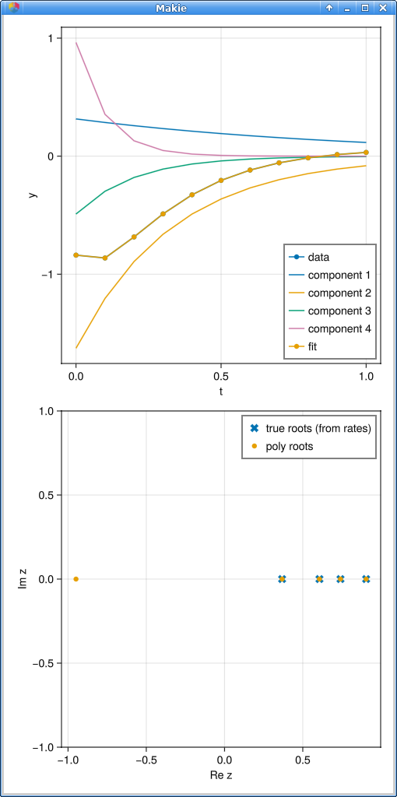

# my-little-prony

Alex Barnett, July 2025

Explore exponential fitting methods such as Prony's, ESPRIT, etc.

## Prony for real decaying exponentials with real coeffs

We assume regular grid data.
There is some uncertainty about which null vector is the best choice.
In Julia, run `src/try_prony.jl`

Results:

```
Try Prony: true decay rates [1.0, 3.0, 5.0, 10.0]
  ampls [0.31552274336867586, -1.6267504320446404, -0.48993012686076465, 0.9627677544110731]

n=11, K=6, M=6.          Hankel sing vals:
6-element Vector{Float64}:
 2.3070636723857008
 0.3176190380197283
 0.03923097422001804
 7.408266604575083e-5
 3.385056490482868e-8
 9.40134784848539e-9
found 4 +ve Re roots with fitted rates:
  [0.9997842638296758, 3.0006634893320516, 5.0024446023333535, 9.99987806580621]
        max root rel error 0.000489
fitted amplitudes:
  [0.3153747092755308, -1.6275144448750392, -0.4890860658079341, 0.962835731178914]
        cond(V)=102,    max resid 1.7e-08
```




