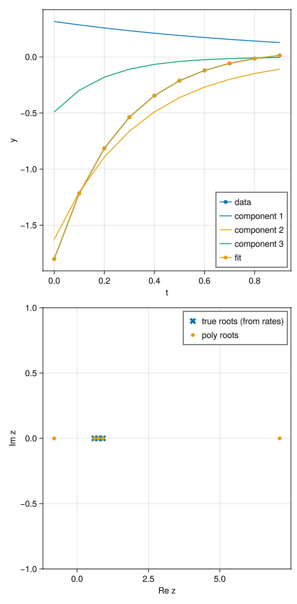

# my-little-prony

Alex Barnett, July 2025

Explore exponential fitting methods such as Prony's, ESPRIT, etc.

## Prony for real decaying exponentials with real coeffs

In Julia, run `src/try_prony.jl`

Results:

```
Try Prony: true decay rates [1.0, 3.0, 5.0]
  ampls [0.31552274336867586, -1.6267504320446404, -0.48993012686076465]

n=10, K=6, M=5.          Hankel sing vals:
5-element Vector{Float64}:
 3.1973381020805136
 0.1168726624254744
 0.0017417203911870487
 1.577673443359995e-8
 1.4943520497383594e-8
found 3 +ve Re roots with fitted rates:
  [0.999967977433918, 3.0000430528738176, 5.000050327410862]
        max root error 5.03e-05
fitted amplitudes:
  [0.315504356874623, -1.6267663498344827, -0.48989580388149906]
        cond(V)=33.4,   max resid 7.59e-09
```




